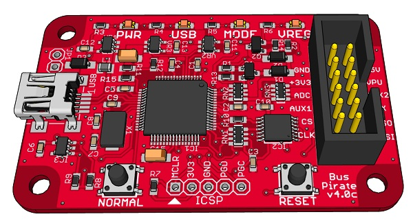
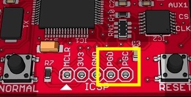
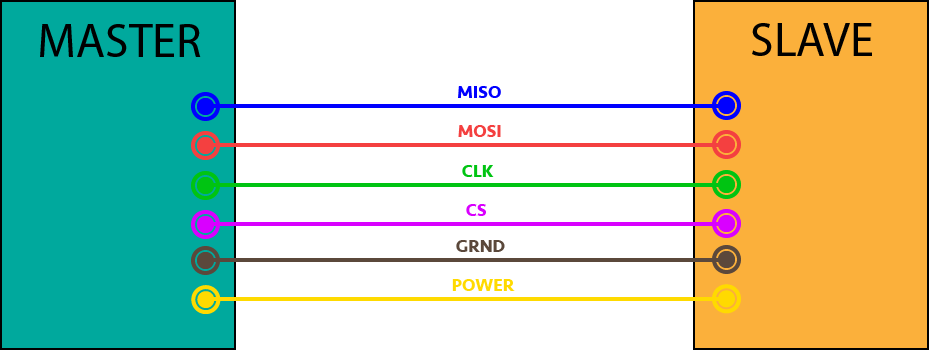
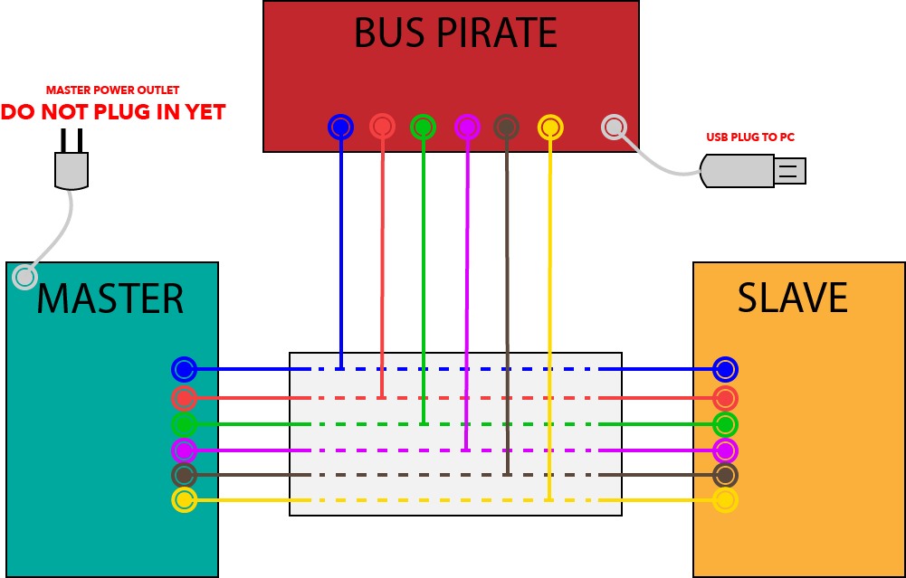

<center></center>

# <center>SPI HOUND</center>

 


SPI Hound is a multi-platform SPI flash vulnerabilities research tool.
The tool features a hardware infrastructure in conjunction with a CLI software which provides security researchers with abilities to monitor and analyze threats related to SPI flash.
- Sniff data communication between Master-Slave components.
- Visualize the memory access pattern of a session.
- Analyze and provide insight into at risk low-level processes (e.g. booting)

<center></center>

## Table of Contents
* [Installation](#installation)
* [Build](#build)
* [Firmware](#firmware)
* [Usage](#usage)
* [Team](#team)
* [FAQ](#faq)
* [Credits](#credits)

## Installation

```console
$ git clone https://github.com/avishyc/spihound.git
```

The software of the tool is already compiled and ready to use in Windows, MacOS and Linux.
See the approprite executable directories at:
- `dist/windows/spihound`
- `dist/macos/spihound`
- `dist/linux/spihound`

Most of the SPI Hound's features may be used with no preparations, except for the sniffer.
The sniffer relies on the hardware of the tool and requires a setup, see the [Firmware](#firmware) section for the instructions.

## Build
If you'd like to modify the source code you'll need to rebuild it.
This section will describe how to do so, step-by-step, from the bottom up.

### Environment
Most of the source code for the software side of the tool is written in python, using multi-platform packages. Dealing with version conflicts of python packages and python itself could be a nightmare, so to overcome this issue we're using the wonerful tools <a href="https://github.com/pyenv/pyenv" target="_blank">**Pyenv**</a> and <a href="https://github.com/pypa/pipenv" target="_blank">**Pipenv**</a>.

1. Install `pyenv` using the instructions found at <a href="https://github.com/pyenv/pyenv" target="_blank">**Pyenv**</a> (Use <a href="https://github.com/pyenv-win/pyenv-win" target="_blank">**Pyenv-win**</a> for Windows).
2. Build the environment's python version specified at [.python-version](./.python-version) installed via
    ```console
    $ cd spihound
    $ pyenv install
    ```
3. Install `pipenv` using the instructions found at <a href="https://github.com/pypa/pipenv" target="_blank">**Pipenv**</a>.
4. Install all the required packages via
    ```console
    $ pipenv install
    ```
    This will use the [Pipfile](./Pipfile) to install all the necessary packges with the right version.

Now that the environment is all setup, we can proceed to the actual build.

### Sniffer
The sniffer's module is implemented in C. We've provided a pre-built library of it for each platfrom as well, so if you havn't touched its code, you may skip this part.

Otherwise, you'll have to compile the dynamic library yourself first.
Under `lib/sniffer` you will find a multi-platfrom [makefile](./lib/sniffer/makefile). 
All you have to do is to change the `OS` variable to your desired platfrom:

```makfile
# CHANGE OS VAR ACCORDING TO YOUR OPERATING SYSTEM
# windows, macos or linux
OS = macos
```

And run make
```console
$ cd spihound/lib/sniffer
$ make
```

If successful, the built library will be placed at `lib/sniffer/bin/YOUR_OS`.

### Executable
The last part of the software build.
We're going to use `pyinstaller` to compile the whole project into an executable.
To do so, all you need to do is run
```console
$ pipenv run pyinstaller --onedir spihound/core/spihound.py
```
This will compile the project and create a folder `dist/spihound` with the executable.
Techincally, you may want to try running the command above with the flag `--onefile` for a single exe without the hassle of the entire directory, but at the time of writting these instructions, pyinstaller has issues with some of the platforms, so we recommend using `--onedir` instead.

If you did choose to build with `--onedir`, you must do the next step:
```console
$ cp -r spihound/lib/* spihound/dist/YOUR_OS/spihound/lib
```
Change `YOUR_OS` to either linux, macos or windows.

Otherwise, add `spihound/sniffer/` to your PATH.

If you have the hardware setup with the tool's firmware, you can go ahead and check out the [Usage](#usage) section.
Otherwise, the next section is for you.


## Firmware
For the the hardware part, SPI Hound makes use of <a href="http://dangerousprototypes.com/docs/Bus_Pirate" target="_blank">**Bus Pirate v4**</a>, a hackers tool which provides a universal bus interface that talks to most chips.
<center></center>

This hardware is essential for the hound's sniffing capability.
Before we can use it, we must load the device with SPI Hound's firmware.
You may look into the <a href="http://dangerousprototypes.com/docs/Compile_the_Bus_Pirate_firmware" target="_blank">**manufacturer's documentation**</a> to do so, but we've compiled the guide here for your benefit.

### Compile SPI Hound Firmware
1. Download and install the microchip's IDE called <a href="http://www.microchip.com/mplab/mplab-x-ide" target="_blank">**MPLAB X**</a> and then <a href="http://www.microchip.com/mplab/compilers" target="_blank">**MPLAB XC16 compiler**</a>.

2. Open MPLAB X, and open the following project file:
```
spihound/firmware/busPirate.X
```

3. Choose the configuration:
```
Run -> Project configuration -> Bus Pirate v4
```

4. Click on **Clean and build**. This will produce .hex file.

### Compile Pirate Loader
The pirate loader will load our generate hex file onto the Bus Pirate device.

- Windows

    You can find a pre compiled exe at
    ```console
    spihound/firmware/BPv4-firmware/pirate-loader.exe
    ```

- Linux / MacOS

    Use the makefile to compile a pirate loader executable.
    ```console
    $ cd spihound/firmware/BPv4-firmware/pirate-loader-v4-source
    $ make
    ```

With `pirate-loader` and the hex file we are ready to load our device.

### Load SPI Hound Firmware
1. Short the PGC and PGD of ICSP header, any metal wire will do the job.

    

2. Plug Bus Pirate to your PC through a USB port.

3. Now we need to find which USB port the device is plugged into.
    - Windows:

        Check the `Device Manager`
    - Linux:
        ```console
        $ dmesg
        ```
    - MacOS:
        ```console
        $ ls /dev/tty.usb*
        ```
4. With the port name we can load the firmware:
    ```console
    $ ./spihound/firmware/BPv4-firmware/pirate-loader --dev=<port> --hex=<hex file>
    ```

    You may see a few skipped regions which is fine, but at the end of this ouput, the load is done.
    ```console
    Erasing page 169, 2a400...OK
    Writing page 169 row 1352, 2a400...OK
    Writing page 169 row 1353, 2a480...OK
    Writing page 169 row 1354, 2a500...OK
    Writing page 169 row 1355, 2a580...OK
    Writing page 169 row 1356, 2a600...OK
    Writing page 169 row 1357, 2a680...OK
    Writing page 169 row 1358, 2a700...OK
    Writing page 169 row 1359, 2a780...OK
    Erasing page 170, 2a800...OK
    Writing page 170 row 1360, 2a800...(SKIPPED by bootloader)...OK
    Writing page 170 row 1361, 2a880...(SKIPPED by bootloader)...OK
    Writing page 170 row 1362, 2a900...(SKIPPED by bootloader)...OK
    ```

> **Before we can use our fresh device we must enforce a reset by disconnecting it from the PC**.


## Usage
Once everything is built, loaded and ready to run, we can finally use the tool.
This Section will explain each feature of the tool, and how to use it.

### How To Sniff
As you may have noticed, dealing with hardware is usually cumbersome. Since the sniffer relies on Bus Pirate, the use of it will also inherit the joys of hardware. That is why this specific section contains subtle instructions which we wholeheartedly recommed to read before use, more than any other section. 

#### Setup
The act of sniffing is inititad through CLI command, but is more importantly a hardware action. 

Our goal is to hijack the communication between a master component and a slave component without interfering it.



SPI Hound will be intertwined with the master-slave connection via Bus Pirate as a <a href="https://en.wikipedia.org/wiki/Man-in-the-middle_attack" target="_blank">**man-in-the-middle**</a> using a <a href="https://en.wikipedia.org/wiki/Breadboard" target="_blank">**Breadboard**</a>.

Instead of directly connecting each line between the master and the slave, use a breadboard as an an intermediate connector for each line, and then plug the appropriate line from bus Pirate as shown in the following layout.

> ***WARNING: Make sure none of the 3 components are plugged into a power outlet (directly or through another machine) before initiating SPI Hound's sniffer. Doing so may fry your componenets.***



We are now ready to sniff. ***DO NOT PLUG IN THE MASTER POWER OUTLET YET.***

#### Run
Plug in the **Bus Pirate** to your terminal PC, and run the sniffer as shown below.


Consult the manual of the slave device to see if the default settings (baudrate, polarity and clock edge) meet its requirements. Most chips will work with the default specs, otherwise you may change them with the optional arguments.

Once the sniffer has entered binary mode, **you may connect the master to the power outlet**.
SPI Hound will inform you via the terminal that the sniffing is done, and create the .com file with the hijacked traffic from this session.

### The Parser
If you take a look at the .com file, it won't make much sense to you. In order to use the analytic tools of SPI Hound, we'll have to parse it.

The .com file is not enough. The parser requires a configuration json detailing essential settings of the slave device.
Take a look at the example [config.json](./resource/config/winbond_W25Q128FV_config.json) and fill one for your slave device using its manual. Usually searching the keys of the config json in the manual will show you the values you need. If your device does not support one of the listed op-codes, don't worry about it.

With a .com file and a config file, the next GIF will show you how to parse.


The parser will genearte a memory access pattern file ([map.csv](./resource/map/map.csv)) and it will be our main resource for the rest of the features.

### Animated Playback
A cool feature for analyzing the session is the playback. Using the parsed map.csv we can view the session as a spectorid.

The blue rectangle represents the address space, where the bottom is the lowest address accessed during the recorded session, and the top is the highest.
The playback shows the reads & writes as a stream of bytes clashing the the address space, where green represents a write to the hitted address, and yellow represents a read from the hitted address.


The playback is interactive by the mouse:
- Left click is Play/Pause
- Right click will reset the playback
- The scroll will increase/decrease the speed.

You have the ability to choose a frame of addresses and time should you choose to focus on an interesting segment, rather than playing the whole session.


### Analysis
This section will cover the two commands:
- Analyze
    ```console
    $ spihound analyze -h                                      
    usage: spihound analyze [-h] [-i [IBLOCKS [IBLOCKS ...]]] mapfile blocksize

    positional arguments:
    mapfile               Memory access pattern as .csv file
    blocksize             Granularity of the block to disect the session's address space
                            by.

    optional arguments:
    -h, --help            show this help message and exit
    -i [IBLOCKS [IBLOCKS ...]]
                            Addresses of interest. Show in-depth details per containing
                            block.
    ```
- Trail
    ```console
    $ spihound trail -h                      
    usage: spihound trail [-h] [-stime Start Time] [-etime End Time] mapfile addr

    positional arguments:
    mapfile            Memory access pattern as .csv file
    addr               The requested address (Accepts decimal and hexadecimal values).

    optional arguments:
    -h, --help         show this help message and exit
    -stime Start Time  Show trail from this timestamp (including). Accepts decimal
                        values.
    -etime End Time    Show trail up to this timestamp (including). Accepts decimal
                        values.

    ```

#### Analyze
The purpose of this command is to disect the hijacked traffic and provide suggestive information about possible security breaches.

The `analyze` command requires the map.csv file and a granularity to work by.
Since fetching bytes occurs the blocks of bytes, it will make sense to analyze each block as a unit to find addresses at risk.

Using the command with no optional arguments will find how many times each block had a gap a hack could tak advantage of. Essentially, the higher the number is the more the block is at risk.

```console
$ spihound analyze resource/map/map.csv 40       


 BLOCK          RR      WR      TOTAL
-------        ----    ----    --------

0x0            120     80      200
0x28           120     80      200
0x50           120     80      200
0x78           120     80      200
0xa0           120     80      200
0xc8           120     80      200
0xf0           72      80      152
0x118          40      80      120
0x140          40      80      120
0x168          40      80      120
0x190          40      80      120
0x1b8          40      80      120
0x1e0          32      80      112
0x208          0       80      80
0x230          0       80      80
0x258          0       80      80
0x280          0       80      80
0x2a8          0       80      80
0x2d0          0       80      80
0x2f8          0       80      80
0x320          0       80      80
0x348          0       80      80
0x370          0       80      80
0x398          0       80      80
...

```

The above data is very shallow to make any conclusion. With the next use of `analyze` we could focus on an interesting block with a deeper view.

With `-i` we can provide a list of _addresses_ we want to dive in. `analyze` will show a complete rundown for every block contatining each address, and will show each memory access in that block thorughout the session:
- What type of access was it.
- The timestamp it occurred.
- The value of the access.

```console
$ spihound analyze resource/map/map.csv 40 -i 0x2
==[ BLOCK 0 ]=================================================

	--[ADDRESS 0x0]-------------------------

	(READS)

		 TIME                VALUE    
		------              -------   
		33.295999999997804  0x80      
		39.53599999999988   0x80      
		43.69600000000128   0x80      
		47.85600000000266   0x80      

	(WRITES)

		 TIME                VALUE    
		------              -------   
		0.048               0xFF      
		32.87199999999765   0x0A      

	--[ADDRESS 0x1]-------------------------

	(READS)

		 TIME                VALUE    
		------              -------   
		33.3039999999978    0x00      
		39.54399999999988   0x00      
		43.70400000000128   0x00      
		47.86400000000266   0x00      

	(WRITES)

		 TIME                VALUE    
		------              -------   
		0.0559999999999999940xFF      
		32.87999999999766   0x0B      

	--[ADDRESS 0x2]-------------------------

	(READS)

		 TIME                VALUE    
		------              -------   
		33.3119999999978    0x00      
		39.55199999999989   0x00      
		43.712000000001275  0x00      
		47.87200000000266   0x00      

	(WRITES)

		 TIME                VALUE    
		------              -------   
		0.064               0xFF      
		32.88799999999766   0x0C      

	--[ADDRESS 0x3]-------------------------

	(READS)

		 TIME                VALUE    
		------              -------   
		33.319999999997805  0x00      
		39.55999999999989   0x00      
		43.72000000000128   0x00      
		47.88000000000267   0x00      

	(WRITES)

		 TIME                VALUE    
		------              -------   
		0.07200000000000001 0xFF      
		32.895999999997656  0x0D      
...

```

#### Trail
This is a simple command.
Provided with the map.csv and an address, it will summerize the liftime of the given address through a timeframe you ask for.

E.g.

```console
$ spihound trail resource/map/map.csv 0x0 -stime 20
Trail of address 0x0 in timeframe [20, 51.97600000000404]
[ START ]====[ 0x0A ]====[ 0x80 ]====[ END ]
```

These are the values byte 0x00000000 had from the 20th msec to the end of the session.

## Team
| <a href="https://www.linkedin.com/in/jonathan-lusky-b8b634130/" target="_blank">**Jonathan Lusky**</a>| <a href="https://www.linkedin.com/in/asaf-rubinfeld/" target="_blank">**Asaf Rubinfeld**</a> | <a href="https://www.linkedin.com/in/avishay-cohen-06a1a114a/" target="_blank">**Avishay Cohen**</a> |
| :---: |:---:| :---:|
|     |  |  |
| Security Researcher | Developer | Developer|

## FAQ
- **What?**
    - Yes.

## Credits
<a href="http://dangerousprototypes.com/blog/bus-pirate-manual/" target="_blank">**Dangerous Prototypes - Open source hardware projects**</a>